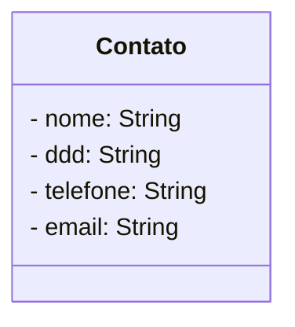

# Pós Tech - Arquitetura de Sistemas .NET
## Tech Challenge Módulo 1

### Problema
O Tech Challenge desta fase será desenvolver um aplicativo utilizando a plataforma .NET 8 para cadastro de contatos regionais, considerando a persistência de dados e a qualidade do software.

### Requisitos Funcionais
- [x] **Cadastro de contatos:** permitir o cadastro de novos contatos, incluindo nome, telefone e e-mail. Associe cada contato a um DDD correspondente à região.
- [ ] **Consulta de contatos:** implementar uma funcionalidade para consultar e visualizar os contatos cadastrados, os quais podem ser filtrados pelo DDD da região.
- [x] **Atualização e exclusão:** possibilitar a atualização e a exclusão de
contatos previamente cadastrados.

### Requisitos Técnicos
- [x] **Persistência de Dados:** utilizar um banco de dados para armazenar as informações dos contatos. Escolha entre Entity Framework Core ou Dapper para a camada de acesso a dados.
- [ ] **Cache:** Implementação de cache no endpoint de consulta de contatos
- [x] **Validações:** implementar validações para garantir dados consistentes (por exemplo: validação de formato de e-mail, telefone, campos obrigatórios).
- [x] **Testes Unitários:** desenvolver testes unitários utilizando xUnit ou NUnit.


### Extras
- [x] Implementado teste de arquitetura;
- [x] Implementado testes de integração utilizando TestContainers;
- [x] Organização dos endpoints utilizando métodos de extensão;

## Executar
```ps1
docker run --name postgres-fiap -e POSTGRES_PASSWORD=docker -e POSTGRES_USER=docker -p 5432:5432 -d postgres


```

## Implementação

### Objetivo
Permitir o cadastro de contatos

### Estrutura de dados

